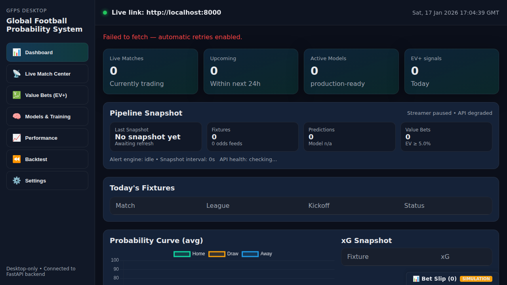
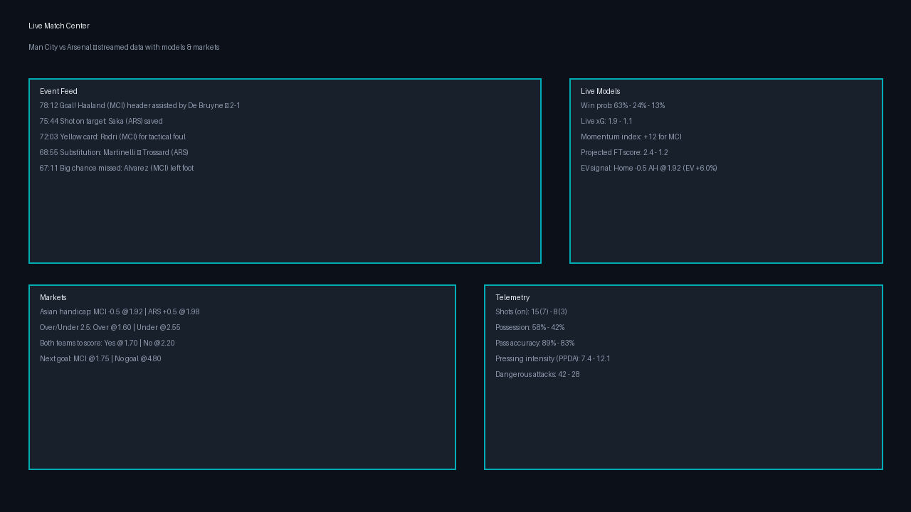
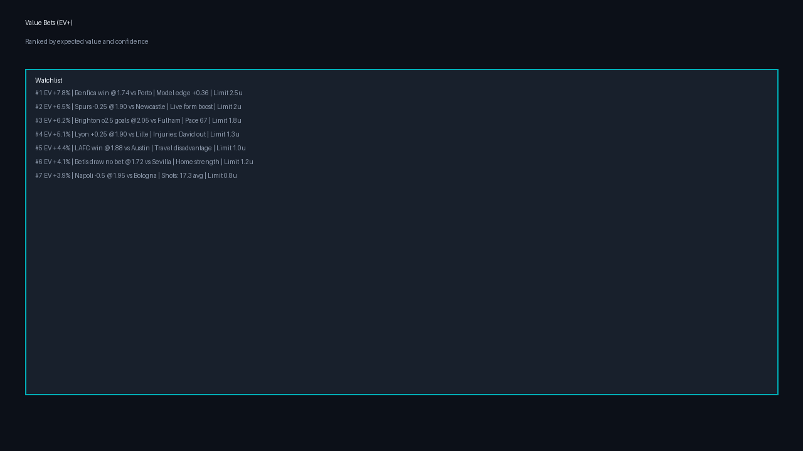
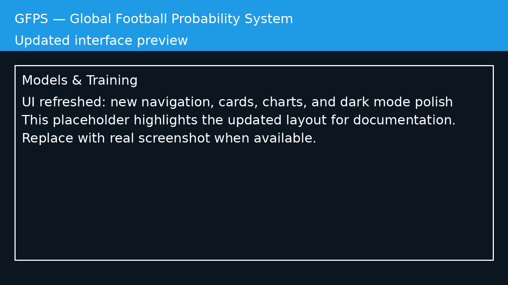
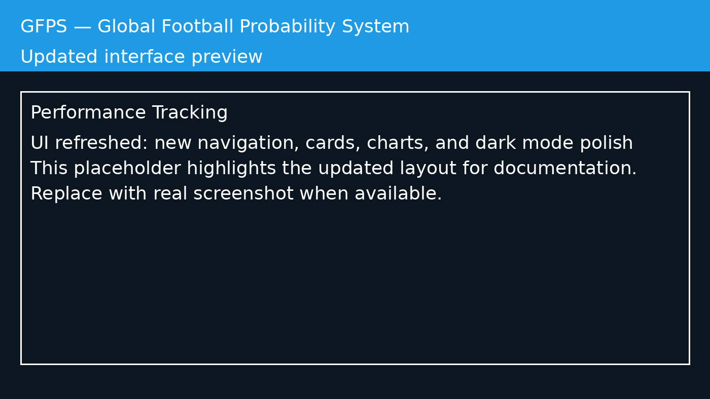
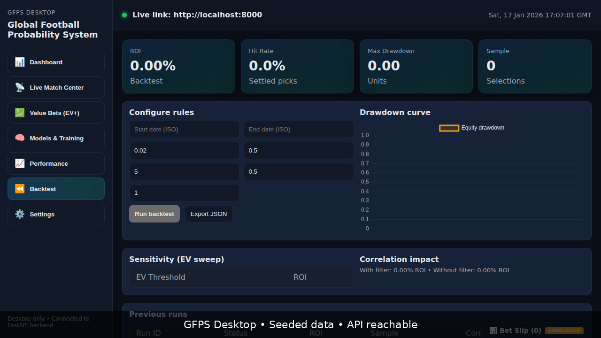
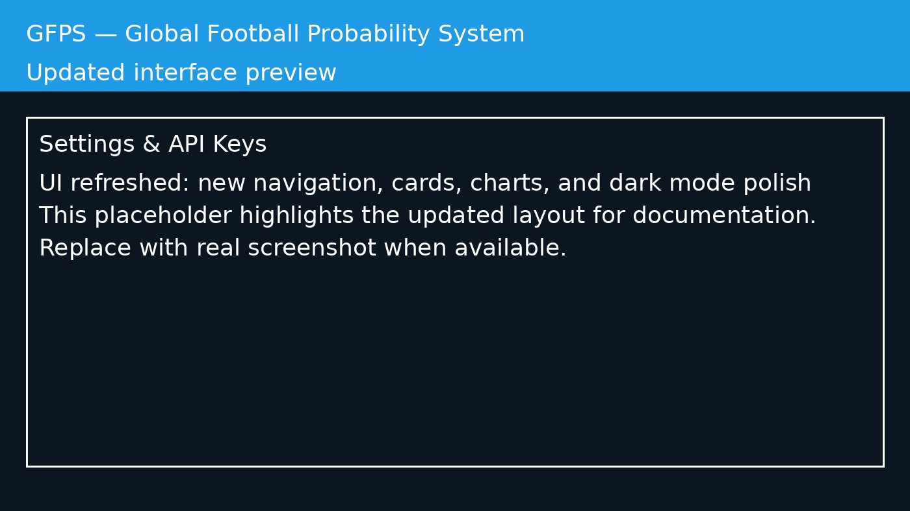

# G.F.P.S – Global Football Probability System

[](https://opensource.org/licenses/MIT)
[](https://github.com/Tsoympet/G.F.P.S-Global-Football-Probability-System/actions/workflows/backend-tests.yml)
[](https://github.com/Tsoympet/G.F.P.S-Global-Football-Probability-System/actions/workflows/frontend-tests.yml)
[](https://github.com/Tsoympet/G.F.P.S-Global-Football-Probability-System/actions/workflows/build.yml)
[](https://github.com/Tsoympet/G.F.P.S-Global-Football-Probability-System/actions/workflows/desktop-ci.yml)
[](https://github.com/Tsoympet/G.F.P.S-Global-Football-Probability-System/actions/workflows/docker-build.yml)
[](https://github.com/Tsoympet/G.F.P.S-Global-Football-Probability-System/actions/workflows/release.yml)
[](https://github.com/Tsoympet/G.F.P.S-Global-Football-Probability-System/actions/workflows/desktop-release.yml)
[](https://github.com/Tsoympet/G.F.P.S-Global-Football-Probability-System/actions/workflows/smoke.yml)

**G.F.P.S** is a production-grade football probability and analytics platform.
It blends Poisson/Dixon-Coles modelling, market odds normalization, EV detection, and a modern desktop client to explain match outcomes with transparent math.


> **📋 Production Readiness:** This repository has undergone a comprehensive security audit and is production-ready. See [docs/AUDIT_REPORT.md](docs/AUDIT_REPORT.md) and the install readiness review in [docs/REPO_READINESS_AUDIT.md](docs/REPO_READINESS_AUDIT.md).

---

## ✨ Key Features

- **Probability Engine**
  - 1X2, totals, and BTTS probabilities from Poisson + Dixon-Coles
  - League and team-strength adjustments with recent form weighting
  - Market-derived calibration via overround/shin de-vigging
- **Expected Value (EV) Engine**
  - EV = (prob * odds) - 1 with configurable thresholds
  - Value bet surfacing in the dashboard and alert engine
- **Live Odds & Alerts**
  - Live odds ingestion with validation + market normalization
  - Alert rules by league, market, odds bands, and EV thresholds
- **Advanced Web Scraper**
  - JavaScript rendering support (Playwright) for dynamic sites
  - Multi-page pagination (URL pattern, click, scroll)
  - Automatic selector learning and discovery
  - Proxy support for geo-restricted content
  - Captcha handling hooks
  - HTML structure change detection and alerting
- **Desktop Analytics Suite**
  - Live match center, model monitoring, and EV watchlists
  - WebSocket streaming for fixtures/events/markets
- **Security & Reliability**
  - JWT auth, rate limiting, request validation, structured error handling
  - Snapshot persistence for offline analytics

---

## 📸 Screenshots

Explore the desktop application interface with these screenshots showcasing the main features:

### Dashboard
The main dashboard provides an overview of live matches, upcoming fixtures, active models, and EV+ signals.



### Live Match Center
Monitor live matches with real-time updates and analytics.



### Value Bets (EV+)
Discover value betting opportunities with configurable EV thresholds and advanced filtering options.



### Models & Training
Manage and train prediction models with performance metrics.



### Performance Tracking
Track your betting performance with detailed ROI, hit rate, and drawdown analytics.



### Backtest Workbench
Run historical backtests to validate strategies and analyze performance.



### Settings
Configure API endpoints, data providers, themes, and authentication.



---

## 📦 Download & Installation

### Pre-built Installers

Download the latest desktop application installers from the [GitHub Releases page](https://github.com/Tsoympet/G.F.P.S-Global-Football-Probability-System/releases):

- **Windows**: Download the `.msi` installer
  - Run the installer and follow the setup wizard
  - Windows may show a SmartScreen warning for unsigned apps - click "More info" → "Run anyway"
  
- **macOS**: Download the `.dmg` file
  - Open the `.dmg` file and drag the app to your Applications folder
  - Right-click the app and select "Open" on first launch to bypass Gatekeeper (for unsigned apps)
  
- **Linux**: Download the `.AppImage` file
  - Make it executable: `chmod +x GFPS*.AppImage`
  - Run it: `./GFPS*.AppImage`

### Release Channels

- **Stable releases** (`v1.0.0`, `v0.1.0`): Production-ready builds for all users
- **Beta releases** (`v1.0.0-beta.1`): Experimental builds with new features (may contain bugs)

### Building from Source

If you prefer to build from source or no pre-built installers are available yet, see the [🚀 Getting started locally](#getting-started-locally) section below.

---

## 🧱 Repository Structure

```text
GFPS/desktop/    # React + Tauri desktop client
backend/          # FastAPI backend, models, alert engine, prediction engine
infrastructure/   # Docker, nginx, monitoring configs
docs/             # Architecture & API documentation
scripts/          # Helper scripts (DB init, seeding, etc.)
branding/         # Logo prompts, brand guidelines
```

---

## 🧠 Architecture Overview

GFPS runs a live analytics pipeline that streams fixtures/odds, computes probabilities, and persists snapshots for offline review.

1. **Ingestion** – API-Football pulls fixtures, events, and odds (seeded fallback data if no key).
2. **Normalization** – Odds are de-vigged, markets validated, and fixtures sanitized.
3. **Prediction Engine** – Poisson + Dixon-Coles with team-strength/form adjustments, market pooling, and calibration.
4. **EV Engine** – EV = (prob × odds) − 1 with threshold filtering for value bets.
5. **Persistence & Delivery** – Snapshots, predictions, and EV lists are stored and served to the desktop client.

---

## 📊 Model & EV Engine

- **Goal model**: Poisson goals with Dixon-Coles low-score correction.
- **Team strength**: league/team attack & defense multipliers + recent form weighting.
- **Market calibration**: overround + Shin de-vigging blended with model outputs using linear pooling.
- **Probability calibration**: temperature scaling to keep distributions coherent and well-calibrated.
- **Expected value**: `EV = (prob × odds) − 1`, filtered via `EV_MIN_THRESHOLD`.

---

## ⚠️ Risk Disclaimer

GFPS provides probabilistic analytics, not guarantees. Football outcomes remain uncertain, and nothing in GFPS is financial advice or a promise of profit. Use responsibly and validate against your own risk tolerance.

---

## 🔌 Extensibility

- Swap or add data providers (API-Football, custom feeds, web scraping).
- Extend markets (totals, handicaps, props) and EV filters.
- Add new model components (Elo, xG, ML ensembles).

### Data providers

GFPS supports multiple data sources that work together:

- **OpenFootball CSV**: Free, offline CSV fixtures (no API key needed)
- **Football-Data.org**: Free API with rate limits (API key required)
- **OpenLigaDB**: Free German league live data
- **API-Football**: Premium API with live odds (subscription required)
- **Web Scraper**: Scrape data from publicly available websites (configurable)

Enable providers via environment variables:
```bash
ENABLE_FOOTBALL_DATA=1    # Football-Data.org API
ENABLE_OPENLIGADB=1       # OpenLigaDB live data
ENABLE_API_FOOTBALL=0     # API-Football premium
ENABLE_WEB_SCRAPER=0      # Web scraping from HTML sources
ENABLE_LIVE_NETWORK=0     # Allow network requests for scraping
```

See [Web Scraper Documentation](docs/web-scraper.md) for details on configuring HTML scraping.

### Data ingestion pipeline

Run the runnable commands from the repository root:

```bash
python -m backend.pipeline_cli ingest_fixtures   # pull + normalize fixtures/results
python -m backend.pipeline_cli ingest_live       # optional live plug-ins (only if allowed)
python -m backend.pipeline_cli build_features    # build bookmaker-style features
```
- Scale out the pipeline with additional workers and storage backends.

---

## 🚀 Getting started locally

For a cross-platform setup guide (Windows/macOS/Linux), see [docs/LOCAL_SETUP.md](docs/LOCAL_SETUP.md).

1. **Install backend dependencies**
   ```bash
   python -m venv .venv
   source .venv/bin/activate
   pip install -r backend/requirements.txt
   ```
2. **Configure environment**
   - Copy `.env.example` to `.env` and fill in the values you have (API Football key, SMTP, Google client ID).
   - If `APIFOOTBALL_KEY` is empty, GFPS serves seeded fixtures only (no live odds).
3. **Run the FastAPI backend**
   ```bash
   uvicorn backend.main:app --reload --host 0.0.0.0 --port 8000
   ```
4. **Run the desktop app (in another terminal)**
   ```bash
   cd GFPS/desktop
   npm install
   # Optional: Set encryption salt for local storage security
   # Copy .env.example to .env and set VITE_SECRET_SALT=$(openssl rand -hex 32)
   npm run dev
   ```
5. **Create a user and log in**
   - The protected endpoints (`/predictions`, `/odds`, `/value`) require a Bearer token.
   - Sign up via `POST /auth/signup` or use Google OAuth via `POST /auth/google`.
   - Log in from the desktop Settings screen to store the token for subsequent calls.
   - **Pay-per-use model**: Users manage their own API provider subscriptions (API-Football, Football-Data.org, Odds Matrix, etc.).
   - Configure your API keys in the Settings screen under "Data Provider API Keys".
   - The client uses your credentials to fetch data from providers you've subscribed to directly.

The desktop client expects the backend at `http://localhost:8000` by default; adjust `FRONTEND_BASE_URL` if you proxy or deploy elsewhere.

### Desktop client hardening

- Live-connected screens for Dashboard, Match Center (probability/xG curves), Value Scanner, Models, and Settings
- WebSocket streaming with HTTP polling fallback, stale-data indicators, offline toggle, and API health surfacing
- Encrypted local storage for API endpoint, EV threshold, refresh interval, theme, cache TTL, and auth token
- Value Scanner with EV slider, league/market filters, probability floor, CSV export, and threshold-aware API calls
- Cached/offline mode with TTL, manual override, and auto recovery when `/health` comes back online
- Tests: `npm test` (Vitest) and production build: `npm run build`
- Installers: `npm run tauri:build` emits `.msi`, `.dmg`, and `.AppImage` artifacts; CI builds on release tags

---

### 🛠️ CMake helper

If you prefer a simple CMake entry point for automation, the root `CMakeLists.txt` wires Python dependencies and tests:

```bash
cmake -S . -B build
cmake --build build --target install_backend_deps
cmake --build build --target run_backend_tests
```

The `install_backend_deps` target installs into your active Python environment; run these commands inside a virtualenv if you want to avoid mutating system packages.
It pulls from `backend/requirements-dev.txt` (which includes pytest). If you've already prepared an environment, configure with `-DGFPS_SKIP_PIP_INSTALL=ON` to skip the install step when running tests.

---

## 🐳 Run with Docker Compose

If you prefer containers, the `infrastructure/docker-compose.yml` file will start Postgres, the FastAPI backend, and optional observability tools:

```bash
cp .env.example .env
docker compose -f infrastructure/docker-compose.yml up --build
```

The backend will listen on port `8000` (or via Nginx on `80` if you keep that service enabled). Update `DATABASE_URL` or streamer flags in `.env` as needed.

### Standalone Docker image

For a single-container backend build, a top-level `Dockerfile` is available:

```bash
docker build -t gfps-backend .
docker run --rm -p 8000:8000 --env-file .env gfps-backend
```

It mirrors the compose backend image and runs `uvicorn main:app` on port `8000`.

---

## 🔎 Quick health check

Use the helper script to verify critical endpoints are reachable:

```bash
AUTH_TOKEN="$(curl -s -X POST -H "Content-Type: application/json" -d '{"email":"test@gfps.app","password":"password123"}' http://localhost:8000/auth/signup | jq -r .token)"
AUTH_TOKEN="$AUTH_TOKEN" ./scripts/check_endpoints.sh http://localhost:8000
```

It probes `/health`, `/odds`, `/predictions`, and `/value` and prints a simple OK/failed summary.

---

## 🌱 Key environment variables

> **⚠️ Security Notice:** `SECRET_KEY` is required and must be set before running the application. See [docs/SECURITY.md](docs/SECURITY.md) for production deployment guidelines.

- `SECRET_KEY`: **REQUIRED** - JWT signing key for auth helpers. Generate with `openssl rand -hex 32`.
- `DATABASE_URL`: Database connection string; defaults to SQLite for local use.
- `APIFOOTBALL_KEY`: API key for live scores/odds. Leave blank for seeded fixtures only.
- `ALLOWED_ORIGINS`: Comma-separated list of allowed CORS origins.
- `RATE_LIMIT_PER_MINUTE`: Request rate limit per client (default 120).
- `MODEL_VERSION`: Label stored with prediction and EV snapshots.
- `EV_MIN_THRESHOLD`: Minimum EV required to surface value bets (default 0.02).
- `DIXON_COLES_RHO`: Dixon-Coles correlation parameter for low-score adjustments.
- `STREAMER_ENABLED` / `STREAMER_INTERVAL_SEC`: Enable and tune the live poller.
- `SNAPSHOT_INTERVAL_SEC`: How often to persist live snapshots + predictions/EV.
- `ALERT_ENGINE` / `ALERT_ENGINE_INTERVAL_SEC`: Toggle the background alert worker.
- `SMTP_*` / `FCM_SERVER_KEY`: Email/FCM notification credentials (optional).
- `GOOGLE_CLIENT_ID`: Enable Google sign-in flows in the auth helpers.

---

## 📚 Documentation

Comprehensive documentation is available in the `docs/` directory. See [docs/README.md](docs/README.md) for a complete documentation index.

### Essential Documentation
- [README.md](README.md) - This file, overview and quick start
- [EULA.md](EULA.md) - End User License Agreement for desktop installers
- [LICENSE](LICENSE) - MIT License for the software
- [DEPLOYMENT.md](docs/DEPLOYMENT.md) - Deployment instructions
- [SECURITY.md](docs/SECURITY.md) - Security best practices and production guidelines
- [ARCHITECTURE.md](docs/ARCHITECTURE.md) - System architecture and design
- [API_REFERENCE.md](docs/API_REFERENCE.md) - API endpoint specifications

For a complete list of available documentation, see the [Documentation Index](docs/README.md).

---

## 🔒 Security

This repository follows security best practices:
- ✅ No default secrets (SECRET_KEY required)
- ✅ Content Security Policy headers configured
- ✅ Automated security scanning (CodeQL)
- ✅ Input validation and SQL injection protection
- ✅ JWT authentication with token versioning
- ✅ Rate limiting and CORS protection

See [docs/SECURITY.md](docs/SECURITY.md) for detailed security guidelines.
