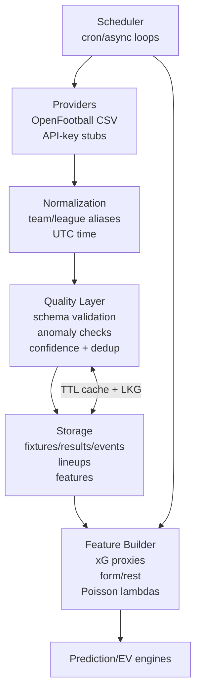

# G.F.P.S – Global Football Probability System
## Architecture Overview

GFPS is composed of three main layers:

1. **Backend (FastAPI, Python)**
2. **Desktop App (React, Vite, Tauri)**
3. **Infrastructure (Docker, nginx, monitoring)**

---

## 1. Backend

**Tech stack:**

- Python 3.x
- FastAPI
- SQLAlchemy
- PostgreSQL / SQLite (configurable)
- httpx (external APIs)
- JWT-based auth
- Optional SMTP + FCM (email & push)

### Core Modules

- `models.py` – SQLAlchemy models
  - `User`, `Device`, `AlertRule`, `AlertEvent`
  - `Coupon`, `CouponSelection`
  - `FavoriteLeague`, `FavoriteTeam`
  - `TeamStats`
- `auth_utils.py` – password hashing, token creation, token decoding
- `fixtures_api.py` – fixtures listing (via API-Football)
- `coupon_api.py` – coupon creation, listing, details
- `favorites_api.py` – favorite leagues and teams
- `device_api.py` – device registration for push notifications
- `alert_engine.py` – background task:
  - polls live fixtures and odds
  - calls prediction engine
  - triggers alerts and logs events
- `snapshot_service.py` – live snapshot persistence, prediction/EV backfills
- `pipeline_api.py` – pipeline health + snapshot status endpoint
- `prediction_engine/` – probability engine:
  - Poisson + Dixon-Coles goal modelling
  - Market normalization (overround + shin) and ensemble pooling
  - EV computation for 1X2, totals, and BTTS
- `stats_api.py` & `stats_context.py` – team strength storage and Poisson context

---

## 2. Desktop App (Tauri)

**Tech stack:**

- React + TypeScript (Vite)
- Tauri 2.0 for native packaging
- Zustand for client state
- Chart.js via `react-chartjs-2` for charts

### Main Screens (under `GFPS/desktop/src/screens/`)

- `Dashboard.tsx` – KPIs, charts and quick insights
- `LiveMatchCenter.tsx` – live fixtures and markets
- `ValueBets.tsx` – EV+ opportunities surfaced from the model
- `ModelsTraining.tsx` – model monitoring/training orchestration
- `Settings.tsx` – app-level configuration

### Shared UI & State

- `components/Sidebar.tsx` & `components/TopBar.tsx` – navigation shell
- `store/navigation.ts` – central navigation state (Zustand)
- `components/DataTable.tsx` & `components/KpiCard.tsx` – reusable widgets

---

## 3. Infrastructure

- `infrastructure/docker-compose.yml`
  - Backend container
  - Database
  - nginx reverse proxy
- `infrastructure/nginx.conf`
  - Reverse proxy to backend
  - HTTPS-ready (Let’s Encrypt configuration can be added)
- `infrastructure/prometheus.yml` & `infrastructure/grafana/`
  - Designed for basic metrics, dashboards and health checks

---

## Data Flow (High Level)

1. **User → Desktop App**
   - navigates dashboard, live matches and value bets
   - reviews model outputs and insights

2. **Desktop App → Backend**
   - requests fixtures & markets (`/fixtures`, `/fixtures/markets`)
   - retrieves predictions/EV data for dashboards and match center
   - manages favorites, alerts, profile

3. **Backend → External APIs**
   - requests fixtures & odds from services like API-Football

4. **Background Engines**
   - `alert_engine` periodically fetches live data
   - uses `prediction_engine` to compute probabilities and EV
   - stores `AlertEvent`s and triggers email / push

---

## Extensibility

GFPS is designed to be:

- **Pluggable** – swap external data providers (API-Football, others)
- **Modular** – each domain (alerts, coupons, stats) is separate
- **Scalable** – multiple backend instances behind nginx & load balancers
- **Extendable** – add new markets, sports, prediction models

---

## Ingestion & Probability Pipeline

